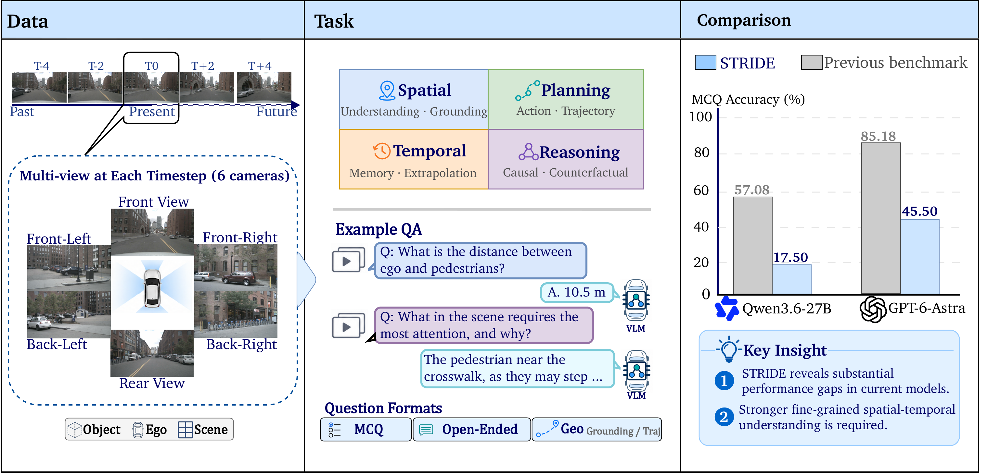

# STRIDE
[](https://arxiv.org/) [](https://lieqi-liu.github.io/STRIDE/) [](https://huggingface.co/datasets/uclanlp/STRIDE)

This repository contains the implementation of the paper:

> **STRIDE: Evaluating Spatiotemporal Reasoning in Driving Edge Cases** <br>
> [Lieqi Liu](https://github.com/Lieqi-Liu)<sup>1\*</sup>, Rui Gao<sup>1\*</sup>, Jia-Chen Gu<sup>1</sup>, Wenbo Hu<sup>1</sup>, Zhaobin Mo<sup>2</sup>, Ahmadreza Moradipari<sup>2</sup>, Nejib Ammar<sup>2</sup>, Wei Wang<sup>1</sup>, [Nanyun Peng](https://vnpeng.net/)<sup>1</sup> <br>
> <sup>1</sup>University of California, Los Angeles &nbsp;&nbsp; <sup>2</sup>Toyota InfoTech Labs <br>
> <sup>\*</sup>Equal contribution

<p align="center">
  
</p>
<p align="center"><em>Figure 1: Overview of STRIDE (data · tasks · comparison). Vector version: <a href="images/STRIDE_v4.pdf">STRIDE_v4.pdf</a>.</em></p>

## Update

- **2026.09**: Initial release of STRIDE annotations (nuScenes + Waymo), evaluation toolkit, and baseline leaderboard.
- **2026.09**: Mini demonstration subsets released under `STRIDE/Mini`.
- **2026.09**: Project website at [`docs/`](./docs) (GitHub Pages).
- **2026.09**: Annotations on Hugging Face at [`uclanlp/STRIDE`](https://huggingface.co/datasets/uclanlp/STRIDE).

## Data Preparation

STRIDE ships **question annotations** (and nuScenes group sidecars) in this repository and on Hugging Face ([`uclanlp/STRIDE`](https://huggingface.co/datasets/uclanlp/STRIDE)). Raw sensor data must be downloaded from upstream datasets; this repo provides the scripts to turn that data into the media layout STRIDE expects.

### 1. Download upstream data

1. **nuScenes** trainval — follow the official [download / ToU](https://www.nuscenes.org/).
2. **Waymo Open Dataset** validation images — follow the official [terms](https://waymo.com/open/terms/).

### 2. Build STRIDE media (self-contained scripts)

**nuScenes** — stitch 6-camera grids, install sidecars, render selected-vehicle query overlays:

```bash
pip install nuscenes-devkit matplotlib   # needed for selected-vehicle overlays
python scripts/prepare_nuscenes_media.py \
  --nuscenes-root /path/to/nuscenes/trainval \
  --output-dir /path/to/formatted_scenes

export STRIDE_NUSCENES_FORMATTED_SCENES=/path/to/formatted_scenes
python scripts/verify_stride_media.py --split nuscenes --require-overlays
```

This installs `STRIDE/nuScenes/formatted_metadata/` into the output directory, stitches the **2×3 multi-camera grids** (`*_grid.jpg`), and writes `{group}_selected_vehicle_render.jpg` query overlays from the shipped annotation tokens.

**Waymo** — no stitching and **no SAM**: verify relative paths only.

```bash
python scripts/prepare_waymo_media.py \
  --waymo-image-root /path/to/waymo/val/images

export STRIDE_WAYMO_IMAGE_ROOT=/path/to/waymo/val/images
python scripts/verify_stride_media.py --split waymo
```

Target-object boxes were computed offline (SAM during construction) and are stored as `bbox_xyxy` in `STRIDE/Waymo/questions.json`. TRJ ranking options ship both ego-frame `candidate_trajectories` and preprojected `candidate_trajectories_image`. At eval time `stride.visual.load_waymo_images` draws the red box / labeled curves — users do **not** run SAM or need Waymo calibration files.

| Split | Size | Image Source | Annotation | Notes |
| :---: | :--: | :----------: | :--------: | :---: |
| nuScenes | 1150 | nuScenes trainval | [`STRIDE/nuScenes`](./STRIDE/nuScenes) | 23 templates × 50; GT-revised open OEQs |
| Waymo | 1200 | Waymo Open Dataset val | [`STRIDE/Waymo`](./STRIDE/Waymo) | 24 templates × 50; `bbox_xyxy` precomputed |
| Mini (nuScenes) | 3 | same as nuScenes | [`STRIDE/Mini`](./STRIDE/Mini) | Schema demo only |
| Mini (Waymo) | 4 | same as Waymo | [`STRIDE/Mini`](./STRIDE/Mini) | Schema demo only |

Note that:

1. **Questions + nuScenes group metadata** ship in this repo and on [Hugging Face](https://huggingface.co/datasets/uclanlp/STRIDE) (including Waymo `bbox_xyxy` / trajectory overlays).
2. **Raw images are not vendored** (upstream licenses / size). Grids + nuScenes query overlays are built locally with `prepare_nuscenes_media.py`.
3. **Always run `verify_stride_media.py`** before inference so missing frames fail fast.
4. **STRIDE Mini** is for schema demonstration only, not for reporting scores.
5. **Scoring** (`python -m stride.cli score`) needs only prediction JSON + shipped questions; **inference** needs the prepared media roots above.

After setup, the layout looks like:

```
├── STRIDE
│   ├── nuScenes
│   │   ├── questions.json
│   │   └── formatted_metadata/          -- shipped group sidecars
│   ├── Waymo/questions.json             -- relative CAM_FRONT paths + overlays
│   ├── Mini/
│   └── statistics/
├── $STRIDE_NUSCENES_FORMATTED_SCENES    -- built by prepare_nuscenes_media.py
│   ├── scene_012/
│   │   ├── 010_*_grid.jpg
│   │   ├── group_002_vehicle_annotations.json
│   │   └── group_002_selected_vehicle_render.jpg
│   └── scene_name_to_formatted_dir.json
└── $STRIDE_WAYMO_IMAGE_ROOT             -- Waymo val/images
    └── <segment_id>/CAM_FRONT/*.jpg
```

## Task Hierarchy

STRIDE is organized around the complementary dimensions of **space** and **time**, plus **driving context** for ego motion and the broader environment (paper §3.1). It comprises **39 question templates** in **six task families**, pairing MCQs that test intermediate judgments with OEQs that assess integration into driving explanations and decisions.

### Space

- **Spatial perception** (`SP-*`). Basic object-level properties that are directly observable from the scene, including relative position, distance, direction of motion, and lane occupancy.
- **Spatial understanding** (`SU-*`). Interprets the *driving significance* of these spatial relationships—whether an object restricts the drivable region, affects lane-change feasibility, constrains the ego vehicle’s motion, or poses a potential risk.

### Time

- **Temporal memory** (`TM-*`). Reconstructs how the current spatial state developed from previous observations: previously visible or disappeared objects, earlier locations, occlusion and reappearance, and recent motion trends.
- **Temporal extrapolation** (`TE-*`). Anticipates how the current scene may evolve, including future object motion, lane occupancy, collision timing, and likely subsequent events.

### Driving context

- **Trajectory prediction** (`TRJ-*`). Assesses the ego vehicle’s past and future motion (ranking, language justifications, and waypoint regression).
- **Scene-context awareness** (`SC-*`). Assesses environmental conditions, road structure, and surrounding activity that provide context for interpreting individual objects and their interactions.

| Family | Split coverage | Formats |
| ------ | -------------- | ------- |
| Spatial perception | nuScenes + Waymo | MCQ + OEQ |
| Spatial understanding | nuScenes | MCQ + OEQ |
| Temporal memory | nuScenes + Waymo | MCQ |
| Temporal extrapolation | nuScenes + Waymo | MCQ + OEQ |
| Trajectory prediction | nuScenes + Waymo | MCQ + OEQ + Geo (`TRJ-5`/`TRJ-6`) |
| Scene-context awareness | nuScenes + Waymo | OEQ (and Waymo MCQs for SC-*) |

**Inputs.** Each question uses a **five-frame** temporal context. nuScenes uses surrounding multi-camera grids; Waymo uses CAM_FRONT. When a target object exists, it is highlighted by a **red box** on the query frame.

## Data Format

The annotation files contain question-answering pairs as follows (fields may vary slightly by split):

```
{
    "meta": {
        "benchmark": "STRIDE",
        "split": "nuscenes",                 -- or waymo
        "n_questions": 1150,
        "...": "..."
    },
    "tasks": [
        {
            "id": "SP-1",                       -- template id
            "task": "space-perception",         -- task family
            "question_format": "MCQ",           -- MCQ or OEQ
            "scoring_type": "mcq",              -- mcq | open_oeq_text | trajectory_waypoints
            "question": <str>,
            "choices": {                        -- MCQ only
                "A": <str>,
                "B": <str>,
                "..."
            },
            "ground_truth": <str>,              -- letter, free text, or waypoint JSON
            "scene_id": <str>,
            "group_id": <str>,
            "object_id": <str>,                 -- when a target object exists
            "source_group_file": <str>,         -- nuScenes: relative group annotation path
            "image_paths": [<str>, ...],        -- Waymo: 5 paths relative to WAYMO_IMAGE_ROOT
            "bbox_xyxy": [<float>, ...],        -- Waymo: precomputed target box (no SAM at eval)
            "candidate_trajectories": {...},    -- Waymo TRJ ranking: ego-frame polylines (m)
            "candidate_trajectories_image": {...} -- Waymo TRJ ranking: preprojected pixels
        },
        ...
    ]
}
```


## Data Usage


### Load the dataset in Python

1. Install dependencies:
  ```bash
   pip install -e .
   # optional BLEURT scoring
   pip install -e ".[bleurt]"
  ```
2. Load a split and inspect tasks:

```python
from stride.aggregate import load_tasks

payload, tasks = load_tasks("nuscenes")  # or "waymo", "nuscenes_mini", "waymo_mini"
print(payload["meta"])
print(tasks[0]["id"], tasks[0]["question"])
```


### Prediction Template

To help users run models against STRIDE, we provide helpers under `evaluation/`:

1. Make sure the directory organization follows [Data Preparation](#data-preparation).
2. Build a blank prediction file:
  ```bash
   python evaluation/make_prediction_template.py \
     --split nuscenes \
     --output runs/my_model_responses.json
  ```
3. Fill each `model_response`:

  | Format        | Expected `model_response`                                                |
  | ------------- | ------------------------------------------------------------------------ |
  | MCQ           | Single letter `A` / `B` / … (also accepts `ANSWER: A`, `{"answer":"A"}`) |
  | OEQ           | Free-form text                                                           |
  | TRJ-5 / TRJ-6 | JSON list of `[x, y]` waypoints (5 or 4 points)                          |

4. Optionally run the OpenAI-compatible multimodal runner:
  ```bash
   export OPENAI_API_KEY=...
   export STRIDE_NUSCENES_FORMATTED_SCENES=/path/to/formatted_scenes
   python evaluation/run_openai.py \
     --split nuscenes \
     --model gpt-4.1 \
     --limit 10 \
     --output runs/gpt41_responses.json
  ```


## Leaderboard

Primary ranking key: **MCQ accuracy**. Open-ended and trajectory metrics are reported separately (no single fused score). Random-guess MCQ baselines are ≈19.8% (nuScenes) and ≈20.3% (Waymo).

As in the overview figure, STRIDE is substantially harder than prior driving VQA suites: even GPT-6-Astra drops from ~85% on previous benchmarks to **45.5%** MCQ on STRIDE (nuScenes).

### nuScenes


| Rank | Model                     | Type                | MCQ ↑     | BLEURT ↑ | Vision judge ↑ | ADE ↓    | mini-FDE ↓ |
| ---- | ------------------------- | ------------------- | --------- | -------- | -------------- | -------- | ---------- |
| 1    | **gpt-6-astra**           | proprietary         | **45.5%** | −0.303   | 6.41           | 0.60     | 0.98       |
| 2    | GPT-5.5                   | proprietary         | 39.3%     | −0.289   | **6.68**       | 0.65     | 0.97       |
| 3    | gemini-3.6-flash          | proprietary         | 38.9%     | −0.238   | 6.50           | 0.69     | 1.01       |
| 4    | gpt-5.6-sol               | proprietary         | 38.5%     | −0.323   | 5.65           | 0.69     | 0.99       |
| 5    | gemini-3.1-pro-preview    | proprietary         | 37.8%     | −0.301   | 4.53           | 1.42     | 1.84       |
| 6    | Qwen3.6 35B-A3B           | VLM                 | 31.6%     | −0.359   | 5.32           | 7.42     | 5.45       |
| 7    | claude-sonnet-5           | proprietary         | 29.4%     | −0.249   | 6.42           | 0.87     | 1.30       |
| 8    | Qwen2.5-VL 3B             | VLM                 | 27.4%     | —        | 3.62           | —        | —          |
| 9    | Qwen3-VL 30B-A3B-Thinking | VLM                 | 26.8%     | −0.321   | 5.45           | 7.12     | 3.42       |
| 10   | Qwen3-VL 8B-Thinking      | VLM                 | 23.4%     | −0.287   | 5.50           | 8.00     | 3.80       |
| 11   | Dolphins                  | expert              | 18.5%     | −0.435   | 3.24           | 8.16     | 3.81       |
| 12   | Qwen3.6 27B               | VLM                 | 17.5%     | −0.402   | 5.99           | 5.81     | 4.06       |
| —    | UniAD 2.0                 | expert (TRJ-5 only) | —         | —        | —              | **0.56** | **0.79**   |


### Waymo


| Rank | Model                     | Type        | MCQ ↑     | BLEURT ↑ | Vision judge ↑ | ADE ↓     | mini-FDE ↓ |
| ---- | ------------------------- | ----------- | --------- | -------- | -------------- | --------- | ---------- |
| 1    | **gpt-6-astra**           | proprietary | **41.2%** | −0.517   | 6.77           | 13.64     | 12.03      |
| 2    | gemini-3.1-pro-preview    | proprietary | 39.7%     | −0.558   | 4.03           | 14.22     | 14.21      |
| 3    | claude-sonnet-5           | proprietary | 39.2%     | −0.504   | **7.01**       | 13.16     | 10.27      |
| 4    | gemini-3.6-flash          | proprietary | 38.8%     | −0.288   | 6.20           | 13.53     | 11.37      |
| 5    | GPT-5.5                   | proprietary | 38.7%     | −0.494   | 7.00           | 13.84     | 12.57      |
| 6    | gpt-5.6-sol               | proprietary | 37.7%     | −0.594   | 6.48           | 13.81     | 12.39      |
| 7    | Qwen2.5-VL 3B             | VLM         | 37.4%     | —        | 2.57           | —         | —          |
| 8    | Qwen3.6 35B-A3B           | VLM         | 34.3%     | −0.539   | 5.83           | 18.55     | 8.86       |
| 9    | Qwen3-VL 8B-Thinking      | VLM         | 32.0%     | −0.663   | 4.72           | 22.36     | 19.37      |
| 10   | Qwen3-VL 30B-A3B-Thinking | VLM         | 31.8%     | —        | 4.98           | **11.83** | **6.18**   |
| 11   | Qwen3-VL 8B-Instruct      | VLM         | 30.1%     | −0.685   | 4.96           | 19.64     | 12.65      |
| 12   | Qwen3.6 27B               | VLM         | 28.4%     | −0.496   | 5.87           | 20.37     | 19.25      |
| 13   | Dolphins                  | expert      | 22.2%     | −0.629   | 1.86           | 18.43     | 8.60       |


Machine-readable tables: [`evaluation/leaderboard`](./evaluation/leaderboard).

# Evaluation

Check [STRIDE Evaluation](./evaluation) for more details.

## Citation

```bibtex
@misc{liu2026stride,
  title        = {{STRIDE}: Evaluating Spatiotemporal Reasoning in Driving Edge Cases},
  author       = {Liu, Lieqi and Gao, Rui and Gu, Jia-Chen and Hu, Wenbo and Mo, Zhaobin and Moradipari, Ahmadreza and Ammar, Nejib and Wang, Wei and Peng, Nanyun},
  year         = {2026},
  note         = {Preprint},
  howpublished = {\url{https://github.com/Lieqi-Liu/STRIDE}}
}
```

